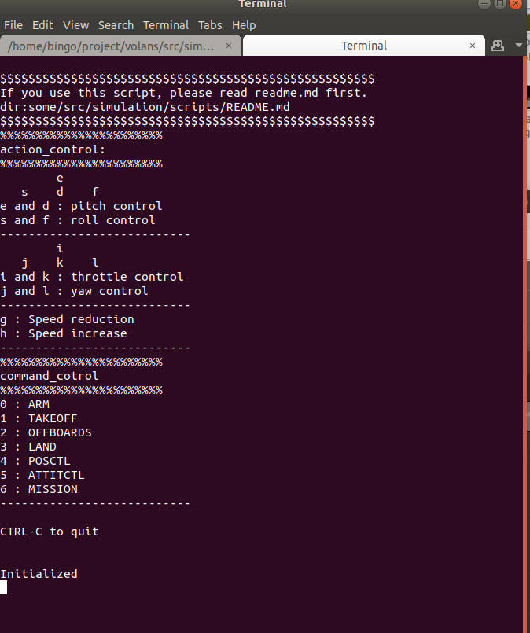

# **四旋翼的仿真与实机**

- Overview

- Simulation

- Px4_control

- Slam

- Map

- Image_process

- Planning

- Volans


  **注：有任何疑问都可在issues提问:)**


# Overview

- software frame


# Simulation

此simulation 包含2D、3D激光雷达模型、深度相机模型、双目相机模型、realsense相机模型、IRlock相机模型。

- 配置PX4以及ros环境

- 编译工作空间，运行launch文件


## 配置PX4以及ros环境

在18.04已测试通过

建议安装Ubuntu18.04 ,gazebo9

这里给出ubuntu18.04安装步骤

### ROS

#### for ubuntu18.04 melodic

1. 添加ros源到 sources.list.

   ```bash
   sudo sh -c 'echo "deb http://packages.ros.org/ros/ubuntu $(lsb_release -sc) main" > /etc/apt/sources.list.d/ros-latest.list'
   sudo apt-key adv --keyserver 'hkp://keyserver.ubuntu.com:80' --recv-key C1CF6E31E6BADE8868B172B4F42ED6FBAB17C654
   sudo apt update
   ```

2. 安装的ros

   ```bash
   sudo apt-get install ros-melodic-desktop
   
   # Source ROS
	echo "source /opt/ros/melodic/setup.bash" >> ~/.bashrc
	source ~/.bashrc
   ```
    并安装ros下gazebo9相关的包
    ```
    sudo apt install ros-melodic-gazebo9*
    ```

3. 初始化ros.

   ```bash
   rosdep init
   rosdep update
   ```

4. 安装catkin编译器.

   ```bash
   sudo apt-get install ros-melodic-catkin python-catkin-tools
   ```

5. 安装mavros 

   参考于 https://dev.px4.io/en/ros/mavros_installation.html. 

   ```bash
   sudo apt install ros-melodic-mavros ros-melodic-mavros-extras
   ```

6. 安装mavros相关的 geographiclib dataset

   ```bash
   wget https://raw.githubusercontent.com/mavlink/mavros/master/mavros/scripts/install_geographiclib_datasets.sh
   chmod +x install_geographiclib_datasets.sh
   sudo ./install_geographiclib_datasets.sh
   ```

参考于：http://wiki.ros.org/melodic/Installation/Ubuntu

### 下载编译px4 Firmware

- 安装必要的工具链

- 下载编译firmware

#### 安装必要的工具链

下载**ubuntu.sh,requirements.txt**

```
wget https://raw.githubusercontent.com/PX4/Firmware/master/Tools/setup/ubuntu.sh

```

```
wget https://raw.githubusercontent.com/PX4/Firmware/master/Tools/setup/requirements.txt
```

然后运行：
```
source ubuntu.sh
```

参考于http://dev.px4.io/master/en/setup/dev_env_linux_ubuntu.html

下载源码：

```
git clone https://gitee.com/bingobinlw/volans
```
#### 下载编译firmware

在此目录下下载px4源码并切换v1.11.0-beta1的固件

```
cd volans
git clone https://github.com/PX4/Firmware
```

或下载码云中的px4源码

```
cd volans
git clone https://gitee.com/bingobinlw/Firmware
```

然后更新submodule切换固件并编译

```
cd Firmware
git submodule update --init --recursive
git checkout v1.11.0-beta1
make distclean
make px4_sitl_default gazebo
```


## 编译工作空间，运行launch文件
编译之前请先安装必要的依赖项

```
sudo apt-get install ros-melodic-ddynamic-reconfigure
```

二维码识别相关包

```
sudo apt-get install ros-melodic-ar-track-alvar*
```

3Dlidar仿真相关的插件包

```
sudo apt-get install ros-melodic-velodyne-gazebo-plugins
```
moveit运动规划相关的包
```
sudo apt-get install ros-melodic-moveit
sudo apt-get install ros-melodic-nav-core
```
编译工程
```
cd volans
catkin config --extend /opt/ros/${ROS_DISTRO} --cmake-args -DCMAKE_BUILD_TYPE=Release
catkin build
```


编译成功后运行`source_environment.sh`添加Firmware环境变量,volans gazebo模型路经,gazebo_modles模型路经

```
source source_enviroment.sh
```

# Px4_control

px4控制以及上层应用模块

## offboard 模式下走圆形轨迹

运行

```
roslaunch simulation circular_px4.launch
```
同时会出现一飞机控制界面，要想使用此脚本请先查看下面路经的README.md

```
dir:volans/src/simulation/scripts/README.md
```



在键盘控制终端中，输入**0**解锁，然后输入**2**切**offboard**,飞机随后会按照你给定的半径与高度飞行，完成一圈后会自动降落。

## offboard 模式下进行二维VFH避障

运行demo之前，请先在QGC中添加航点，然后上传，VFH节点将读取航点信息，当作目标点。

然后重新运行

```
roslaunch simulation obstacle_avoidance_2Dlaser_vfh_px4.launch 
```


中间终端为GCG中各航点的平面信息，读取航点成功后，在最后一个控制终端中输入**2**然后回车，VFH节点将开始工作。

# Slam

运行slam-Demo之前请先安装必要的功能包，具体请看

```
roscd ros_slam
查看README.md
```

## gmapping_slam

运行

```
roslaunch simulation gmapping_demo_px4.launch
```


## cartographer
cartographer在2019年10月份已经支持以ros包形式安装。若想运行此demo请先安装必要cartogra包。具体请看ros_slam包中的**README.md**

### 2Dlidar location

运行demo之前请先在QGC参数表中配置参数，选择EKF位置来源来自板载计算机

```
EKF2_AID_MASK = 24
```

cartogra节点将接收2d激光雷达以及无人机的imu话题。

```
roslaunch simulation cartographer2Dlidar_location_demo_px4.launch
```

在定位之前请在键盘控制界面用键盘的**'g'**键调整uav的允许速度为1570，降低uav的运动时的倾斜角度以及速度，以达到更好的定位效果。

结果


### 2Dlidar mapping

如果你想建立更加准确的地图，而且你的robot已经拥有里程计。那么cartogra能够生成准切而稳定的map，不会存在location模式中地图会飘的情况。

运行demo之前请先在QGC参数表中配置参数，选择EKF位置来源来自gps

```
EKF2_AID_MASK = 1
```

cartogra节点将接收2d激光雷达以及无人机的里程计话题

```
roslaunch simulation cartographer2Dlidar_mapping_demo_px4.launch
```

### 3Dlidar location

使用运行demo之前请先确保以安装3D雷达相关插件

for ubuntu 18.04

```
sudo apt-get install ros-melodic-velodyne-gazebo-plugins
```

使用一个16线的激光雷达，以及一个imu数据，激光雷达水平安装在飞机的顶部。就其定位效果来看，没有发现2Dlidar定位时会飘的情况，而且无人机速度倾斜角度都可以大幅提高。


运行

```
roslaunch simulation cartographer3Dlidar_demo_px4.launch
```
## rtabmap slam
使用深度相机以及室内里程计，为了达到更好的建图效果，其中室内里程计选择用3Dcartogra.
运行demo之前请先安装必要的rtabmap ros包

```
sudo apt-get install ros-melodic-rtabmap-ros
```

请先在QGC参数表中配置参数，选择EKF位置来源来自板载计算机

```
EKF2_AID_MASK = 24
```

运行demo

```
roslaunch simulation rtabmap_depthCam_mapping_demo_px4.launch
```

参考于：http://wiki.ros.org/rtabmap_ros

建图效果：


# Map

运行map-Demo之前请先安装必要的功能包，具体请看

```
roscd octomap
查看README.md
```

## octomap

安装octomap相关ros包

```
sudo apt-get install ros-melodic-octomap-*
```

### depth camera 

运行

```
roslaunch simulation octomapdep_px4.launch 
```

建图效果


### 3Dlidar

运行

```
roslaunch octomap_3Dlidar_px4.launch
```

建图效果


# Image_process
## vision landing

二维码降落


运行demo之前请先安装必要的ros包

```
sudo apt-get install ros-melodic-ar-track-alvar*
```

运行

```
roslaunch simulation landing_px4.launch
```

然后在键盘控制界面输入'0' 解锁，输入'2'切入OFFBOARD，飞机会自动起飞降落到目标板。

视频链接：[landding vision](https://www.bilibili.com/video/av89393095)
## vision tracking

二维码跟踪


运行

```
roslaunch simulation tracking_px4.launch
```

然后在键盘控制界面输入'0' 解锁，输入'2'切入OFFBOARD，然后在转入gazebo界面输入键盘的**“w a s d”**可控制汽车移动。

# Planning

## ros navigation

运行demo之前请先安装必要的导航包

```
sudo apt-get install ros-melodic-navigation
```

运行

```
roslaunch simulation ros_2Dnav_demo_px4.launch
```

在键盘控制界面解锁无人机，并控制无人机起飞

然后在rviz界面使用2D Nav Goal 设置目标点，

然后在键盘控制界面输入2运行offboard模式。


也可在线调参，在终端中输入如下命令即可。
```
rosrun rqt_reconfigure rqt_reconfigure
```


参考于：http://wiki.ros.org/navigation

视频链接：[px4 ros navigation](https://www.bilibili.com/video/av86842219)

# Volans实机

待定

  **注：有任何疑问都可在issues提问:)**
